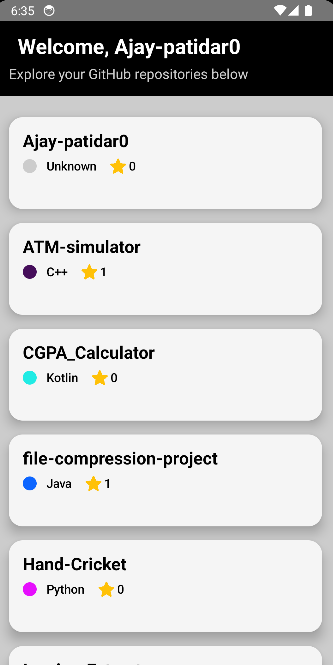

# GitSearch - GitHub Repository Search App

> 🚀 This project is part of [GirlScript Summer of Code 2025 (GSSoC'25)]

GitSearch is an Android application that allows users to search and explore GitHub repositories by entering a GitHub username. The app fetches the public repositories of the user and displays them in an organized and user-friendly interface, including details such as repository name, description, programming language, and the number of stars.

## Features

- **User Search**: Allows users to search for GitHub repositories by entering a GitHub username.
- **Repository List**: Displays the list of repositories for the searched username with key details like name, description, programming language, and stars.
- **Error Handling**: Shows appropriate error messages if no repositories are found or if the username is invalid.
- **Loading Indicator**: Displays a loading spinner while fetching repository data.

## Screenshots


*Sample screenshot of the main screen.*


*Sample screenshot of the repository list.*


*Sample screenshot of the error message.*

## Tech Stack

- **Android**: Kotlin
- **Jetpack Compose**: UI components
- **Hilt**: Dependency Injection
- **Retrofit**: For making API calls to GitHub
- **Coroutines**: For asynchronous operations
- **Material3**: UI design system

## Getting Started

To run this project locally, follow these steps:

### Installation

1. Clone the repository to your local machine:

    ```bash
    git clone https://github.com/Ajay-patidar0/gitsearch.git
    ```

2. Open the project in Android Studio.

3. Sync the project with Gradle files by clicking `Sync Now` in the toolbar.

4. Build and run the app on a device or emulator.

### Configuration

This app uses the GitHub API to fetch repositories. You do not need any additional API keys for this basic version.

## Usage

1. Open the app and enter a GitHub username in the input field.
2. Press the "Search" button to fetch the repositories of the entered user.
3. View the list of repositories with details such as name, description, language, and stars.
4. If no repositories are found or the username is invalid, an error message will be displayed.

## App Flow

1. **Main Screen**: The user enters a GitHub username and the app fetches repositories.
2. **Loading State**: Displays a loading spinner while data is being fetched.
3. **Success State**: Displays the list of repositories if the data is fetched successfully.
4. **Error State**: Displays an error message if no repositories are found or if the username is invalid.

## Architecture Overview

This app follows the **MVVM (Model-View-ViewModel)** architecture pattern:

- **Model**: The data layer that interacts with the GitHub API to fetch user repository data. The `GitHubRepository` class handles network calls and serves as the data provider for the ViewModel.
- **View**: The UI layer built using **Jetpack Compose**. It observes the data from the ViewModel and updates the UI accordingly. The view is reactive and responds to changes in the data.
- **ViewModel**: The `MainViewModel` acts as the intermediary between the View and Model. It manages the state of the UI, processes data, and interacts with the `GitHubRepository` to fetch repository data. The ViewModel exposes this data in a lifecycle-conscious manner (e.g., using LiveData or StateFlow).


## Libraries Used

- **Jetpack Compose**: UI toolkit for modern Android apps.
- **Hilt**: Dependency Injection for managing app dependencies.
- **Retrofit**: HTTP client for making network requests to the GitHub API.
- **Coroutines**: For handling asynchronous operations.
- **Material3**: For UI components and design system.

## License

This project is licensed under the [MIT License](./License.md).


